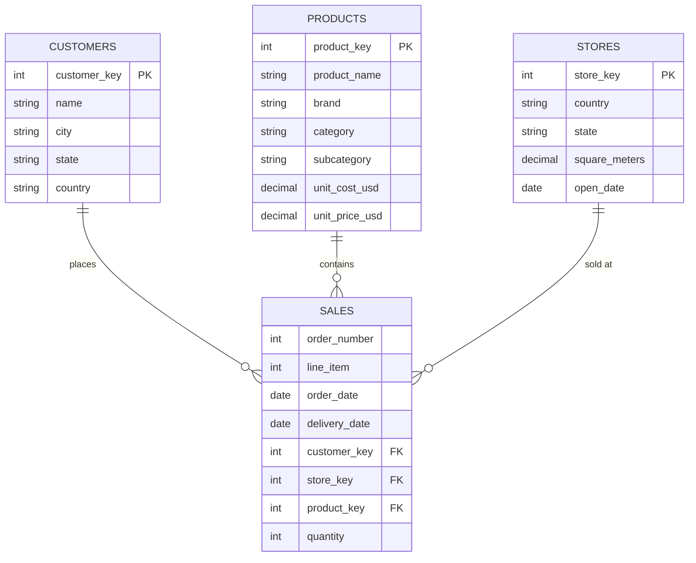

# Retail Sales Analysis with SQL

Answering **14 business questions** from stakeholders across a global electronics retail chain — CRM, Merchandising, Finance, Marketing, and the C-suite — using pure SQL on SQL Server.
## Dataset

### Retail — Global Retail Holdings
Retail is a multinational retail chain specializing in the distribution of high-end consumer products (electronics, home appliances, accessories, toys, cosmetics) for the North American, European, Asian, and Australian markets. The company operates hundreds of physical stores across more than 20 countries, combined with an online channel. Estimated annual revenue is approximately $1.2 billion, with over 1.5 million active customers and a product catalog of over 2,500 SKUs across 8 main categories: Computers, Cell Phones, Home Appliances, Audio, TV and Video, Games and Toys, Cameras and Camcorders, and Music.

### Business Structure
Retail operates on a centralized merchandising + decentralized operations model:

Merchandising HQ (USA) determines the catalog, list prices, and negotiates purchase prices with vendors. The average gross margin is approximately 40%, with some categories like Computers at only around 20%, while Music can reach 60%.
Regional operations (North America, EU, APAC, Oceania) manage the store network, recruit staff, and handle logistics. Each store has a different size — from 100m² (express store downtown) to 3,000m² (flagship mall store).
Customer data is consolidated into a master database with demographics (gender, birthday, address). Retail doesn't differentiate customers by channel, but the current dataset only tracks physical transactions.

### Pain points:
Delivery delays — the difference between order and delivery dates can range from 1 day to 30 days. Operations wants to know which stores are prone to delays.
Customer churn — will customers who bought in 2020 return in 2023? No one has tracked cohort retention yet.
Store cannibalization — will two stores in the same state cannibalize each other? Ecom HQ suspects this but has no proof.

| Table | Description | Key columns |
|---|---|---|
| `retails.sales` | Order line items | `order_number`, `line_item`, `order_date`, `delivery_date`, `quantity` |
| `retails.products` | Product catalog | `product_key`, `brand`, `category`, `subcategory`, `unit_cost_usd`, `unit_price_usd` |
| `retails.customers` | Customer master | `customer_key`, `city`, `state`, `country`, `continent`, `birthday` |
| `retails.stores` | Store master | `store_key`, `country`, `state`, `square_meters`, `open_date` |



### Sample data
#### retails.customers
|customer_key|gender|name|city|state_code|state|zip_code|country|continent|birthday|
|---|---|---|---|---|---|---|---|---|---|
|301|Female|Lilly Harding|WANDEARAH EAST|SA|South Australia|5523|Australia|Australia|1939-07-03|
|325|Female|Madison Hull|MOUNT BUDD|WA|Western Australia|6522|Australia|Australia|1979-09-27|
|554|Female|Claire Ferres|WINJALLOK|VIC|Victoria|3380|Australia|Australia|1947-05-26|
|786|Male|Jai Poltpalingada|MIDDLE RIVER|SA|South Australia|5223|Australia|Australia|1957-09-17|
|1042|Male|Aidan Pankhurst|TAWONGA SOUTH|VIC|Victoria|3698|Australia|Australia|1965-11-19|

#### retails.products
|product_key|product_name|brand|color|unit_cost_usd|unit_price_usd|subcategory_key|subcategory|category_key|category|
|---|---|---|---|---|---|---|---|---|---|
|1|Contoso 512MB MP3 Player E51 Silver|Contoso|Silver|6.62|12.99|101|MP4&amp;MP3|1|Audio|
|2|Contoso 512MB MP3 Player E51 Blue|Contoso|Blue|6.62|12.99|101|MP4&amp;MP3|1|Audio|
|3|Contoso 1G MP3 Player E100 White|Contoso|White|7.40|14.52|101|MP4&amp;MP3|1|Audio|
|4|Contoso 2G MP3 Player E200 Silver|Contoso|Silver|11.00|21.57|101|MP4&amp;MP3|1|Audio|
|5|Contoso 2G MP3 Player E200 Red|Contoso|Red|11.00|21.57|101|MP4&amp;MP3|1|Audio|

#### retails.sales
|order_number|line_item|order_date|delivery_date|customer_key|store_key|product_key|quantity|
|---|---|---|---|---|---|---|---|
|1000000|1|2017-09-26|NULL|1152038|38|220|7|
|1000000|2|2017-09-26|NULL|1152038|38|1523|1|
|1000000|3|2017-09-26|NULL|1152038|38|2103|3|
|1000000|4|2017-09-26|NULL|1152038|38|2112|7|
|1000001|1|2017-09-26|2017-10-01|240085|0|1513|1|

#### retails.stores
store_key|country|state|square_meters|open_date|
|---|---|---|---|---|
|0|Online|Online|NULL|2010-01-01|
|1|Australia|Australian Capital Territory|595.00|2008-01-01|
|2|Australia|Northern Territory|665.00|2008-01-12|
|3|Australia|South Australia|2000.00|2012-01-07|
|4|Australia|Tasmania|2000.00|2010-01-01|
## Business Questions

All queries live in (queries/retail_sales_analysis.ipynb).

### Easy — aggregations & filtering

| # | Stakeholder request | SQL concepts |
|---|---|---|
| 1 | How many orders did the whole chain sell in 2021? (for a presentation slide) | `COUNT(DISTINCT)`, date filtering |
| 2 | List every product category with its SKU count, alphabetically (product mix overview) | `GROUP BY`, `ORDER BY` |
| 3 | Top 10 cities by customer count, for choosing a customer-appreciation event location | `TOP`, multi-column `GROUP BY` |
| 4 | Total revenue (price × quantity) across all stores for Dec 2020 — for the P&L board deck | `JOIN`, CTE, date range |
| 5 | Number of physical stores per country, descending (which market dominates?) | `GROUP BY`, filtering out the online channel |

### Intermediate — joins, window functions, anti-joins

| # | Stakeholder request | SQL concepts |
|---|---|---|
| 6 | Top 5 best-selling products **within each category** for Q1 restock planning | CTE + `DENSE_RANK() OVER (PARTITION BY ...)` |
| 7 | Average gross margin % per subcategory (only subcategories with ≥ 10 SKUs) to evaluate pricing strategy | `AVG`, `HAVING`, margin math |
| 8 | Average order-to-delivery days per customer country — which country has the slowest delivery SLA? | `DATEDIFF`, `NULL` handling (in-store orders have no delivery date) |
| 9 | The single top-spending customer in each country in 2020, for a year-end VIP campaign | CTE chain + `DENSE_RANK()` per country |
| 10 | "Zombie inventory": products in the catalog that have **never** sold a single unit | `LEFT JOIN ... WHERE IS NULL` (anti-join) |

### Advanced — cohorts, running totals, market basket

| # | Stakeholder request | SQL concepts |
|---|---|---|
| 11 | Monthly revenue **and** cumulative revenue over the most recent 24 months, for a CEO trend slide | `SUM() OVER (ORDER BY ...)` running total, dynamic date anchor |
| 12 | **Customer retention cohort matrix**: of customers who first bought in year X, what % returned in X+1, X+2, X+3? | Cohort analysis, `MIN` first purchase, conditional aggregation (`CASE` pivot) |
| 13 | Revenue per m² for every store (physical only) and its **quartile rank within its country** | `NTILE(4) OVER (PARTITION BY country ...)` |
| 14 | Top 20 **product pairs bought together** in the same order, as input for a recommendation engine | Self-join on `order_number`, pair de-duplication (`a < b`), basket share % |

## Techniques Highlighted

- **CTEs** for readable, layered logic (single and multi-step chains)
- **Window functions**: `DENSE_RANK`, `NTILE`, running `SUM() OVER`
- **Cohort / retention analysis** built from raw transactions
- **Market basket analysis** via self-join with pair de-duplication
- **Anti-join** pattern for "never sold" detection
- Careful handling of `NULL` delivery dates, online vs. physical channels, and revenue vs. profit definitions

## Repository Structure

```
├── dataset/                        # Sample data (markdown previews) + query results
├── queries/
│   ├── retail_sales_analysis.ipynb # 14 business questions + T-SQL answers
│   └── explore_tables.sql          # Quick data exploration script
└── README.md
```

